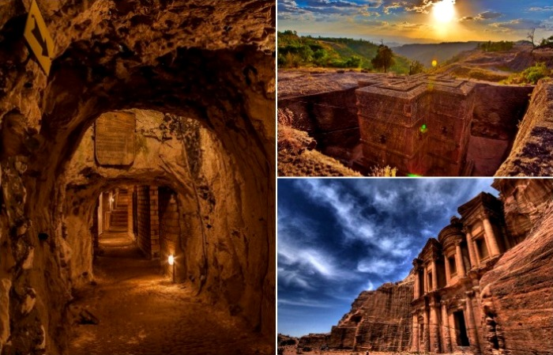
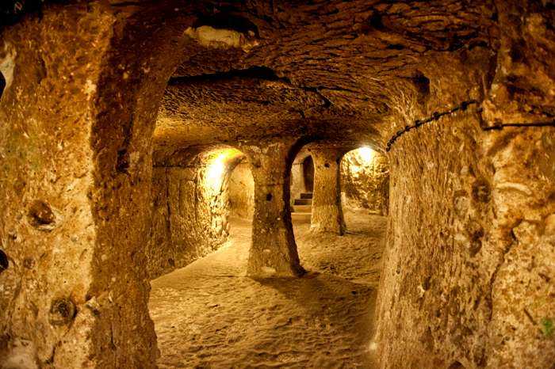
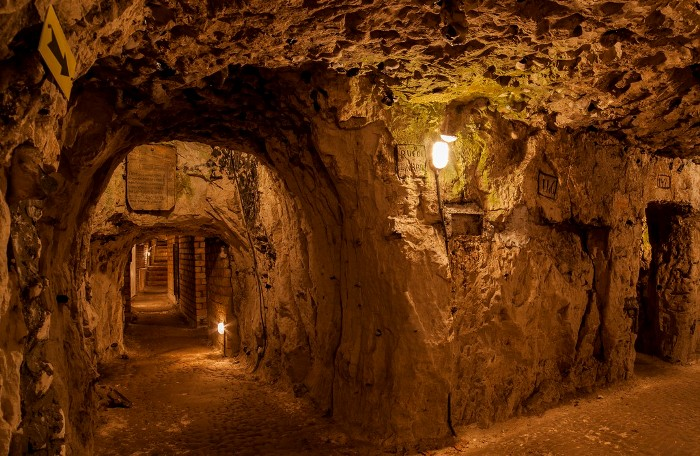
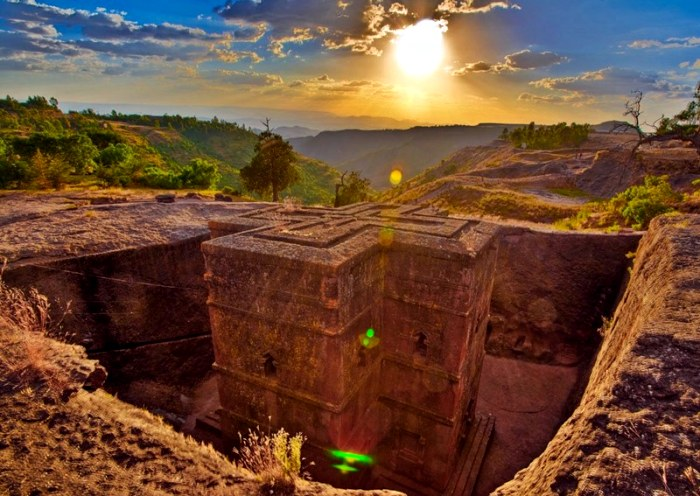

# "New Jerusalem" and "Burlington Bunker": 6 spectacular settlements hidden underground

Tourist points on the map of the planet are sometimes not only on the ground, but also under it. However, not everyone knows about them. And in vain, because history keeps episodes of creation of unique underground structures, and they were built hundreds and thousands of years ago, and recently, but their impressive scale from time to time do not depend. To your attention, there are six striking settlements, located underground.

1. Derinkuyu

Among the volcanic rocks of the Turkish Cappadocia region, the most extensive and impressive is rightly considered Derinkaya. This huge underground complex of labyrinths historians refer to around the 8th century B.C. and, apparently, was built to provide shelter for the population during wars and enemy invasions.

It is hard to imagine, but Derinkaya is, in fact, a self-contained city 18 floors deep with ventilation shafts, wells, kitchens, oil presses, baths, wineries, and, most importantly, living quarters that can accommodate about 20 thousand people. All this underground splendor in case of attack was reliably sealed with monolithic stone doors on each level.

2. Naur

The underground city of Naur (also known as Naurs) is located in the northern part of France, and consists of three kilometers of tunnels with more than three hundred rooms, which are securely covered under the wooded area at a depth of about 30 meters. The settlement offers accommodation for more than three thousand people, as well as autonomous chapels, stables, wells and bakeries.

The first traces of human civilization appeared on the territory of Naur in the third century AD, when Roman quarries began to be located there, but later the mine was significantly expanded to the size of a real underground city. This process was dictated by historical context: at that time, there were active internecine wars and medieval invasions, and locals began to use the structures as a shelter.

3. Lalibela

This grandiose structure has a saying name - "New Jerusalem". Lalibela is a complex of secret caves and catacombs, which are connected to several churches. The most famous of the latter is the Church of St. George, made in the form of a cross. The structure is carved from a monolithic piece of stone rock inside a huge trench three dozen meters deep.

The mechanism of underground city Lalibela construction is interesting. The point is that its construction was going from top to bottom: first, the churches were carved from volcanic rocks underground, and then were pushed out. Thus, it gave the buildings the appearance as if they had grown right out of the ground. Today, Lalibela has not lost its sacral meaning, and its churches are considered sacred places for the Ethiopian Orthodox Church.

